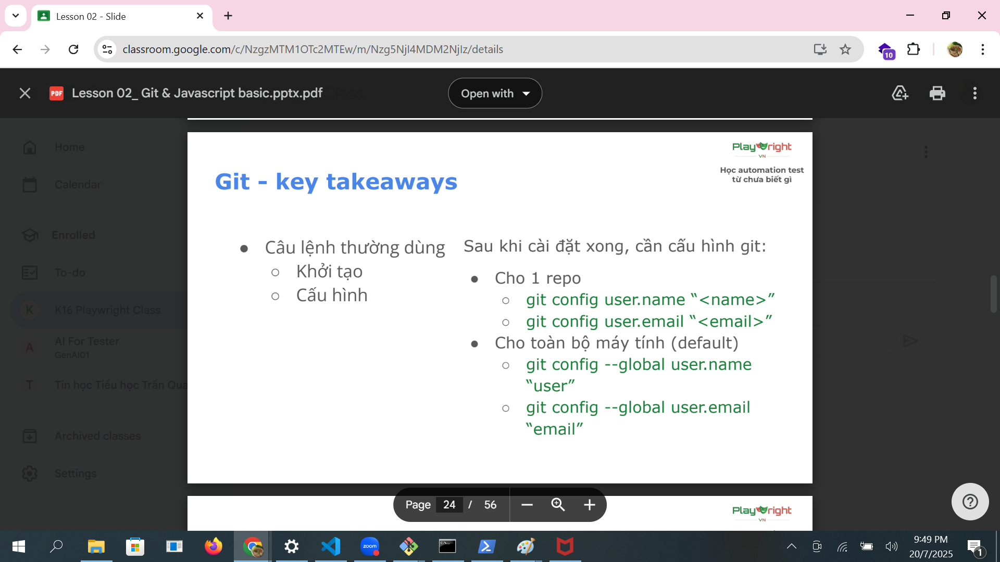
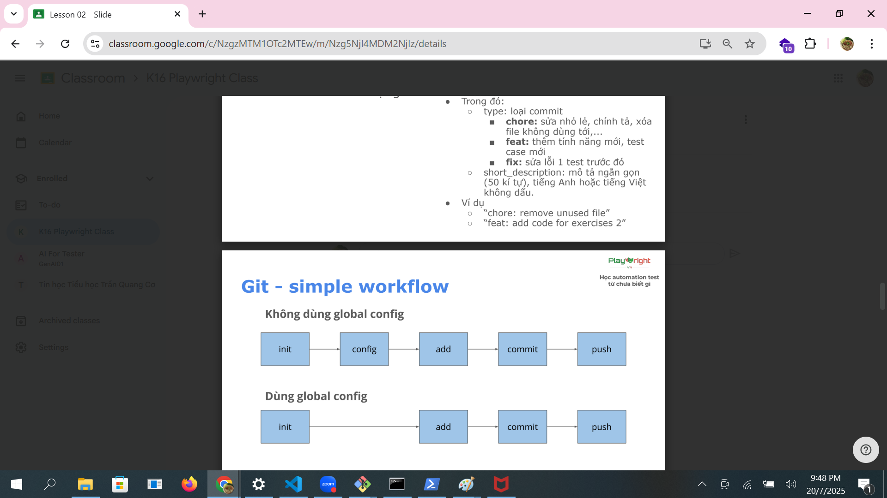
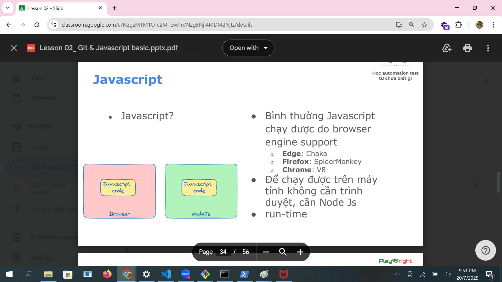
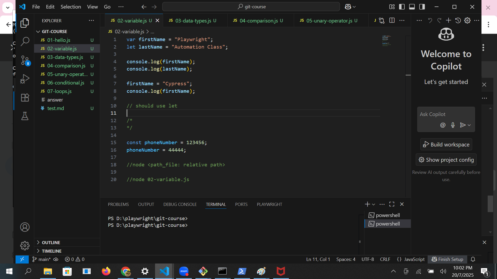
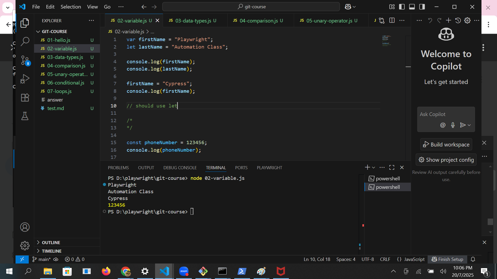
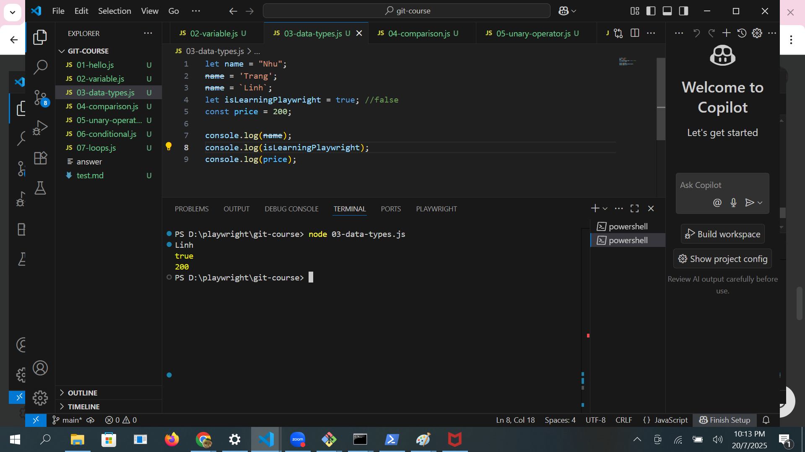
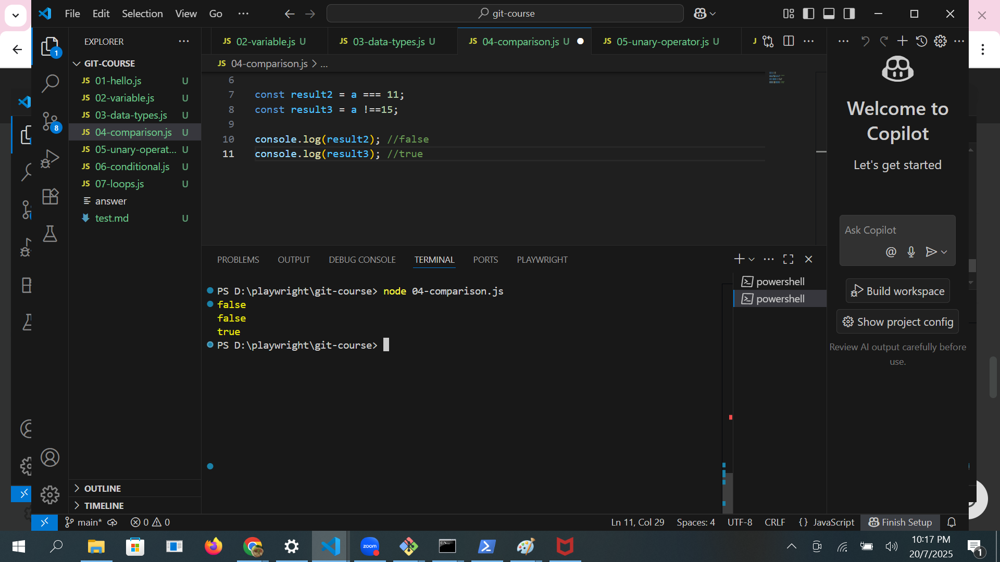
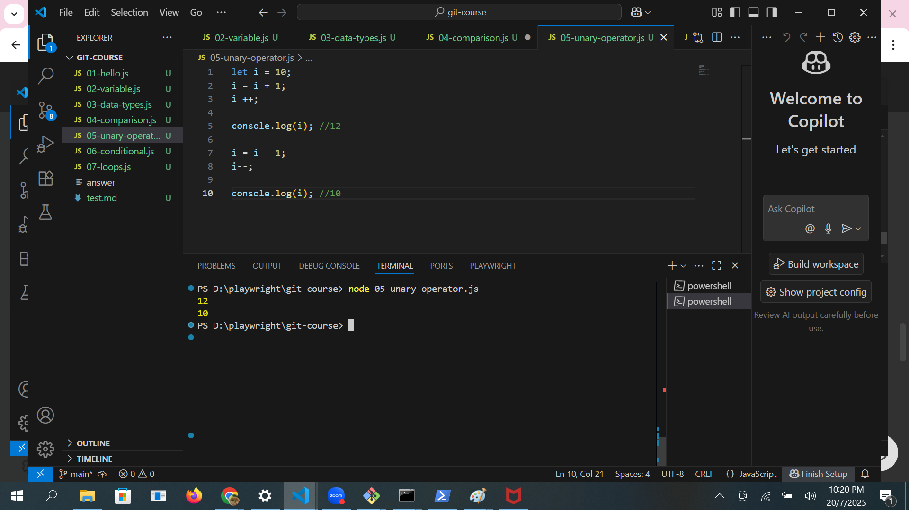
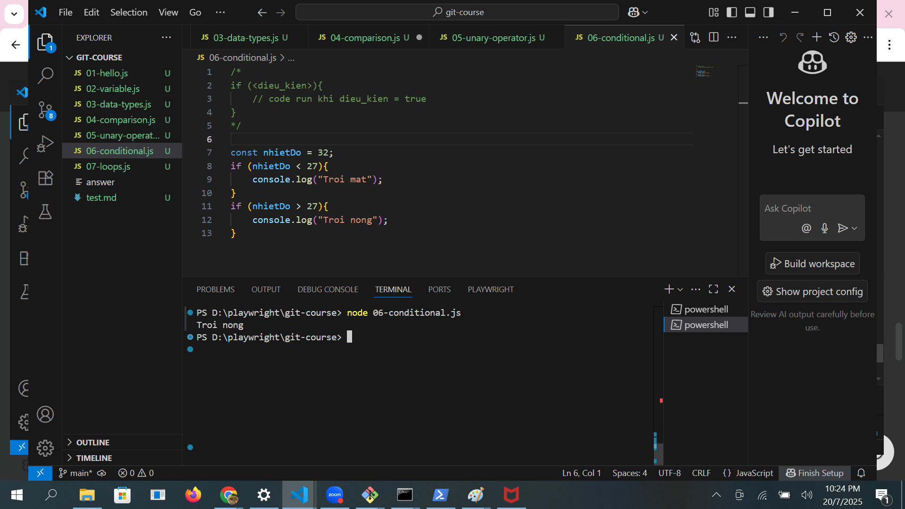
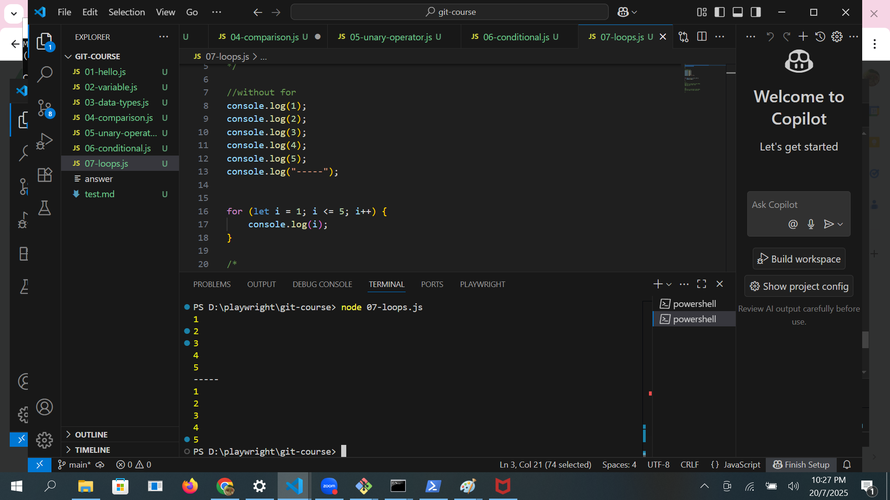

# Version control system
1. VCS: Hệ thốNg quản lý các phiên bản (ví dụ: Google Docs)
2. Các cách lưu:
- Local: máy cá nhân
- Centralize: máy chủ tập trung
- Distributed: nhiều máy khác nhau

# Git
1. Dùng git: do nhu cầu quản lý phiên bản và làm việc giữa nhiều người với nhau
2. Git & GitHub
3. Git - three states
- Working directory: các file mới hoặc file có thay đổi
- Staging Area: các file đưa vào vùng chuẩn bị commit (tạo ra các phiên bản)
- Repository: Các commit (phiên bản)

**Key takeaways**: Các câu lênh thường dùng
1. Khởi tạo thư mục được quản lý bởi Git: git init
2. Cấu hình git

3. Thêm file vào vùng staging:
- Thêm 1 file : git add <filename.extension>
- Thêm toàn bộ: git add .
4. Xem trạng thái file: git status
- File *màu xanh*: vùng *staging*
- File *màu đỏ*: vùng *working directory*
5. Commit: git commit -m"message"
- Kiểm tra lịch sử commit: git log

## Git - commit convention
- Commit message cần rõ ràng, chuyên nghiệp
- Dùng convention sau: 
<type>: <short_description>

# Javascript basic

## Cách chạy project
- Tạo thư mục 
- Mở bằng VS Code (trong cmd): code .
- Tạo file: xx.js
- Ghi vào dòng: console.log("Hello World!");
- Chạy lệnh trong Terminal: node xx.js (copy relative path của file)

## Khai báo biến - variable
1. Định nghĩa: Dùng để lưu trữ giá trị, có thể thay đổi giá trị được
2. Khai báo: let <tên_biến> = <giá_trị>;
3. Ví dụ:

## Khai báo hằng số - constant
1. Định nghĩa: Dùng để khai báo các giá trị không thể thay đổi
2. Khai báo: const <name> = <value>
3. Ví dụ:

## Khai báo kiểu dữ liệu - Data type
1. Định nghĩa: Có 8 loại kiểu dữ liệu: String, Number, Boolean, (Bigint, Undefined, Null, Symbol, Object)
2. Khai báo: String (chuỗi), Number (số), Boolean (kiểu true hoặc false)
3. Ví dụ:

## Khai báo toán tử so sánh - comparison operator
1. Định nghĩa: dùng để so sánh giá trị giữa 2 biến với nhau. Kết quả sẽ trả về Boolean (true hoặc false)
2. Khai báo: 
Các toán tử so sánh:
- So sánh hơn kém: >, <
- So sánh bằng: ===, !==, >=, <=
3. Ví dụ:

## Khai báo toán tử một ngôi - Unary operator
1. Định nghĩa: dùng để tăng hoặc giảm giá trị
2. Khai báo: 
- i++ bằng với i=i+1
- i-- bằng với i=i-1
3. Ví dụ:

## Khai báo toán tử số học - Arithmetic operator
1. Định nghĩa: dùng tính toán giá trị biểu thức
2. Khai báo: 
Các phép toán: +, -, *, /

## Khai báo điều kiện - conditional
1. Định nghĩa: dùng để kiểm tra có nên thực hiện một đoạn logic không
2. Cú pháp: 
if (<điều kiện>) {//code}. Nếu điều kiện đúng, sẽ chạy đoạn code
3. Ví dụ:

## Khai báo vòng lặp
1. Định nghĩa: dùng để thực hiện một đoạn logic một số lần nhất định
2. Cú pháp: 
for (<khởi tạo>; <điều kiện đúng>; <điều kiện tăng){//code
3. Ví dụ:

## Format code:
- Mac: Option + Shift + F
- Window: Alt + Shift + F

## Kiến thức bổ sung để làm bài
1. Toán tử chia dư (%): % sẽ trả về phần dư của phép tính
- Nếu là số lẻ, chia dư cho 2 = 1: x % 2 === 1
- Nếu là số chẵn, chia dư cho 2 = 0: x % 2 === 0
2. In kết hợp giá trị chuỗi và biến với console.log()
- console.log("message")
- console.log(variable_name)
- console.log("message" + variable_name)
- console.log("message: , variable_name)
3. Nối chuỗi với toán tử +  
Để nói chuỗi từ hai biến, ta sử dụng dấu cộng (+):
- const str1 = "Hello";
- const str2 = "Playwright Viet Nam";
- console.log(str1 + str2); // HelloPlaywright Viet Nam