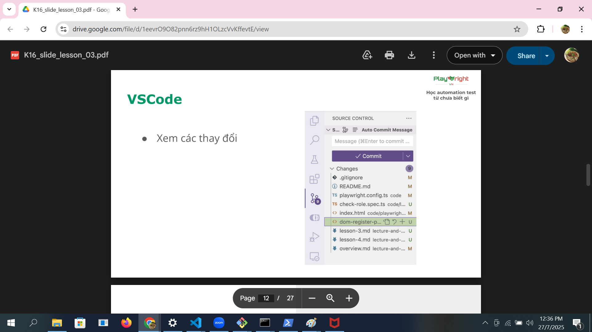

# Git
## Undo actions
1. Thay đổi commit message: 
/*
git commit --amend
- Gõ i -> vào chế độ insert
- Gõ esc để thoát insert
- Gõ “:wq” -> write and quit

git commit --amend -m”message”
*/

2. Đưa từ vùng staging về working directory: git restore --staged <file>

3. Đưa từ vùng repository về working directory (uncommit): git reset HEAD~1 (undo 1 commit)

## Branching model
1. Branching model: 
- Branch = nhánh: Dùng branch để tạo ra một vùng làm việc mới, không ảnh hưởng tới vùng làm việc đã ổn định.
- Tạo branch:  

git branch <ten_branch>
git checkout <ten_branch>
git checkout -b <ten_branch>
  
 tips: Luôn tạo branch mới trước khi thực hiện một lệnh copy từ internet

 2. gitignore file: Dùng để bỏ qua các file không cần git theo dõi.

 gitignore = GitIgnore = Bỏ qua

 - Ignore file <file_name>
 - Ignore folder <folder_name>

# VSCode

# Javascript basic
1. Convention: qui tắc
- snake_case: chưa dùng  snake_case_now_now
- kebab-case: tên file   kebab-case-now-now
- camelCase: tên biến    camelCaseNowNow
- PascalCase: tên class  PascalCaseNowNow

2. console.log with ' and "
console.log(`${variable_name}`)

/*
let name = "Nga"
console.log(`Tôi là ${name}`);
console.log("Tôi tên là" + name + "")
*/

## Object:
- Object = đối tượng, dùng để lưu trữ tập hợp các giá trị
vào cùng một biến hoặc hằng số
- Khai báo:
let/const <ten_object> = {
<thuoc_tinh>: <gia_tri>,
...
}

Trong đó:
- <thuoc_tinh>: giống quy tắc đặt tên biến
- <gia tri>: có kiểu giống biến, hoặc là 1 object khác.

Ví dụ:
- let user = {“name”: “Alex”, “age”: 10, “email”: “alex@gmail.com”}
- const product = {
“name”: “Laptop”,
“price”: 500,
“isWindow”: true,
“manufacturer”: {
“name”: “Acer”,
“year”: 2024
}

Sử dụng:
- console.log("name = " + user.name);
- console.log("manufacturer name = " + product.manufacturer.name);
- console.log(“price = “, product[“price”]);

Gán lại
- user.age = 28
- product[“manufacturer”][“year”] = 2025

Thực hành
let student = {
    "name": "Alex",
    "class",
    "finalGrade":8.5
}

student.class = "K6";
console.log(`Student name: ${student["class"]}`);
student.major = "Automation"

## Logical operator
1. Khai báo
&& : cả 2 vế của mệnh đề đều
đúng
|| : một trong 2 vế đúng
! : đảo ngược lại giá trị của mệnh đề

2. Thực hành
let a = true;
let b = false;

let c = a && b; //false
let d = a || b; //true

console.log(c);
console.log(d);

## Array
1. Tạo mảng
- Khai báo
- Sử dụng
2. Truy xuất mảng
- Độ dài mảng: length
- Lấy phần tử theo index:[0], [1], [2]
3. Thực hành
- Khai báo mảng các học sinh lớp K10
                // 0       1      2       3        4      5
let studentArr = ["Hân", "Yến", "Linh", "Trang", "Bình", false, 5, {studen: {age: 18}}]
const count = studentArr.length;
console.log(count);
console.log(studentArr[0]);
console.log(studentArr.indexOf("Linh"));
// ko có phần tử trong mạng thì in ra -1

## Function
1. Định nghĩa: Function = hàm, là đoạn code được đặt tên và có thể tái sử dụng, thực hiện 1 nhiệm vụ hoặc 1 tính toán cụ thể.
2. Khai báo
function <nameFunction>() {
// code
}
3. Parameter
4. Return value
5. Thực hành
function helloWorld(){
    console.log("Hello world!")
};

heelWorld();

function printStudentName(studentName){
    console.log(`Ten hoc vien: ${studenName}`)
};

printStudentName("Viet Anh");

//viet ham tinh tong > tra ve tong cua a va b
function calculate(a,b){
    const sum = a + b;
    return sum;
};

const total = caculate(5,6);
console.log(total);

let studentArr = ["Hân", "Yến", "Linh", "Trang", "Bình"]

function printArrChar(studentArr){
    for (let i=0, i<studentArr.length; i++){
        console.log(studentArr[i]);
    }
}

printArrChar(studentArr);
