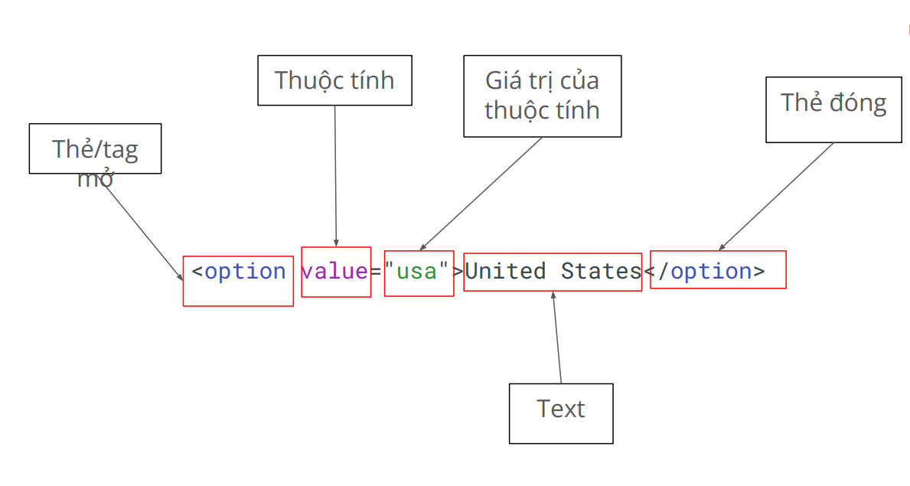

# Function advance
1. Lambda function (Arrow function)
- Một cách ngắn gọn viết hàm trong JS.
- Sử dụng dấu => thay vì từ khoá function
- Cú pháp:
(parameters) => {
 // Code here
}
- Ví dụ: 
```javascript
const add = (a,b) => {
    return a + b;
}
console.log(add(2,2)));
```

2. Anonymous functions
- Hàm không có tên
- Thường được sử dụng 1 lần hoặc làm đối số truyền vào các hàm khác
- Cú pháp:
function (parameters) {
 // Code here
}
- Ví dụ:
```javascript
let greet = function () {
    console.log("K16 Playwright");
}
greet();
```

# DOM
- DOM = Document Object Model
- Ví dụ thực tế: https://material.playwrightvn.com/01-xpath-register-page.html
- Node


## Thẻ HTML thường gặp
- Thẻ <div> (viết tắt của divide): dùng để chia các khối trong trang web
- Thẻ <h1></h1> đến <h6></h6> (viết tắt của heading): dùng để tạo ra các header phân cấp
theo thứ tự từ lớn đến bé.
- Thẻ <form></form>: dùng để chứa một form thông tin.
- Thẻ input: text, email, radio, checkbox, file, color, range, date
- Thẻ textarea: hiển thị ô input, dạng to.
- Thẻ radio button: tạo nút chọn một (radio).
- Thẻ checkbox: tạo nút chọn nhiều lựa chọn (checkbox).
- Thẻ list và dropdown: hiển thị danh sách hoặc menu thả xuống.
- Thẻ button: tạo nút bấm.
- Thẻ table: hiển thị bảng dữ liệu.
- thead = table heading
- tr = table row = 1 dòng
- th: table heading: text in đậm
- tbody
- tr -> td = table data
- Thẻ date picker: tạo bộ chọn ngày.
- Thẻ slider: tạo thanh trượt.
- Thẻ iframe: hiển thị nội dung từ một trang web khác bên trong trang hiện tại.

# Selector
- Là cách chọn phần tử trên trang
- Có nhiều kiểu: ○ XPath selector ○ CSS selector ○ Playwright selector
## XPath selector
- XPath = XML Path
- Có 2 loại:

○ Tuyệt đối: đi dọc theo cây DOM
 - bắt đầu bởi 1 /

○ Tương đối: tìm dựa vào đặc tính
 - bắt đầu bởi 2 //
 - //tenthe[@thuoctinh=”gia  tri”]

- Nên dùng XPath tương đối

# Playwright basic syntax
1. test: Đơn vị cơ bản để khai báo một test
```javascript
import { test } from '@playwright/test';
test('<tên test>', async ({ page }) => {
 // Code của test
});
```
2. step: Đơn vị nhỏ hơn test, để khai báo từng step của test case
```javascript
await test.step('Tên step', async () => {
 // Code here
});
```
ví dụ:
```javascript
test('<tên test>', async ({ page }) => {
 await test.step('Tên step', async () => {
 // Code here
 });
});
```
3. Navigate
```javascript
await page.goto('https://pw-practice.playwrightvn.com/');
```

4. Click
- Single click
await page.locator("//button").click();
- Double click
await page.locator("//button").dblclick();
- Click chuột phải
page.locator("//button").click({
 button: 'right'
})
- Click chuột kèm bấm phím khác
page.locator("").click({
 modifiers: ['Shift'],
})
```javascript
import { test } from '@playwright/test';

test("Test 01", async ({ page }) => {
 await test.step('Single click', async () => {
    await page.goto("https://material.playwrightvn.com/01-xpath-register-page.html");
    await page.locator("//div[@id='clickArea']").click();
 });
});

test("Test 02", async ({ page }) => {
 await test.step("Single click", async () => {
    await page.goto("https://material.playwrightvn.com/01-xpath-register-page.html");
    await page.locator("//div[@id='clickArea']").click();
 });

  await test.step("Double click", async () => {
   await page.locator("//div[@id='clickArea']").dbclick();
    await page.locator("//div[@id='clickArea']").click();{
        clickCount: 2
    }
 });

 await test.step("Shift + click", async () => {
   await page.locator("//div[@id='clickArea']").click({
        modifiers: ["Shift"]
   });
 });

 await test.step("Right + click", async () => {
   await page.locator("//div[@id='clickArea']").click({
        button: "right"
   });
 });

});
```

5. Input
- Fill: Giống việc bạn paste content vào một ô input
page.locator("//input").fill('Playwright Viet Nam');

```javascript
test("Test 01", async ({ page }) => {
 await test.step('Navigate to Register Page', async () => {
    await page.goto("https://material.playwrightvn.com/01-xpath-register-page.html");
 });
 await test.step("Fill info", async () => {
     await page.fill("//input[@id='username']", "Playwright");
     await page.locator("//input[@id='email']").fill("playwright@gmail.com");
     await page.locator("//textarea[@id='bio']").pressSequentially("Hello", { delay: 200      
     })
    
 });
});
```
- pressSequentially: Giống việc bạn gõ từng chữ cái vào ô input
page.locator("//input").pressSequentially('Playwright Viet Nam', {
 delay: 100,
});

6. Radio/checkbox
- Lấy giá trị hiện tại đang là check hay không:
const isChecked =
page.locator("//input").isChecked();
- Check/ uncheck
page.locator("//input").check();
page.locator("//input").setChecked(false);

```javascript
await page.locator("//input[@id='female']").check();
     await page.locator("//input[@id='reading']").setChecked(true);
     await page.locator("//select[@id='country']").selectOption("australia");
```
7. Select option
```javascript
     await page.locator("//select[@id='country']").selectOption("australia");
```

8. Set Input File
```javascript
await page.locator("input=[@id='profile']").setInputFiles("tests\lesson-5\test-data\image.txt");
```
Lưu ý: nên tạo file và đẩy lên repository trước khi up file lên

# Kiến thức bổ sung để làm bài
## hover
Để hover vào phần tử, ta dùng hàm hover:
```javascript
await page.locator("<xpath here>").hover();
```
## text
Hàm text()dùng để tìm ra phần tử có giá trị tương ứng. Ví dụ
```javascript
//Với DOM sau:
<div @class=”playwright”>This is a text</div>
//Thì để chọn phần tử này, ta dùng cú pháp như sau:
div[text()=’This is a text’]
```

## constains()
Đôi khi trong phần tử HTML, phần tử sẽ bị thừa khoảng trắng, hoặc có các giá trị không cố định trong text. Ví dụ
<div> Tôi là Alex </div> // Text này có 1 ký tự space ở đầu và ở đuôi
<div> Bây giờ là: 08:07 </div> // Thời gian sẽ tuỳ vào thời điểm truy cập trang web
Để chọn các phần tử này, ta dùng hàm contains(<giá trị>, <giá trị contains>). Ví dụ
```javascript
//div[contains(text(), ‘Tôi là Alex’)]
//div[contains(text(), ‘Bây giờ là:’)]
```

## Tương tác với `confirmation dialog`
```javascript
test("Test Dialog", async ({ page }) => {
    await page.goto("https://material.playwrightvn.com");
    await page.click("//a[@href='03-xpath-todo-list.html']");
    await page.locator("//input[@id='new-task']").fill("Task1");
    await page.click("//button[@id='add-task']");
    page.on('dialog', async dialog => dialog.accept())
    await page.click("//button[text()='Delete']");

  });
```
